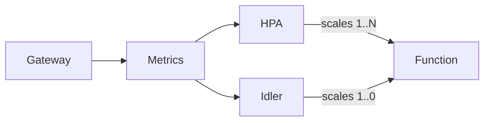

# JustFaaS

JustFaaS is a set of components for deploying and running auto-scaled functions and microservices on [Kubernetes](https://kubernetes.io/). No vendor-lock, no boilerplate code, language agnostic and no *reinventing the wheel*. 

> **Warning** 
> This is still a work in progress and not yet production-ready material. Feel free to explore, but usage in a production environment is still premature.

## Features

- No vendor-lock
- No boilerplate code or templates
- Automatically scale your functions
- Async requests
- Management APIs
- Custom resource definitions

## Articles and Documentation

- [Official documentation](https://docs.justfaas.com/)
- [Serverless for Kubernetes](https://medium.com/@goncalo-a-oliveira/serverless-for-kubernetes-f8f7d9ad7edd) on Medium

## How it works

Functions are deployed to Kubernetes using a [CRD](https://kubernetes.io/docs/tasks/extend-kubernetes/custom-resources/custom-resource-definitions/). Behind the scenes, a custom operator deploys the required resources for the function.

When invoking a function through the gateway, metrics are fed to a [Prometheus](https://prometheus.io/docs/introduction/overview/) instance which are then scraped by the metrics server and exported to Kubernetes as custom metrics.

Both the scaler and the idler components feed off of custom metrics, in order to scale the functions up or down as required.

> **Note**
> The idler component is not installed by default. An option must be set when installing/upgrading to enable the idler. The reason for this is that the idler is seen as a future deprecation, since Kubernetes will most likely offer a solution for this in future releases. You can read more about [scaling to zero](https://docs.justfaas.com/reference/scale-to-zero/) in the docs.

## Sponsors

Like most open-source projects, its success depends on its contributors and sponsors. If you like the project and use it personally or commercially, please consider sponsoring. Every little helps.
